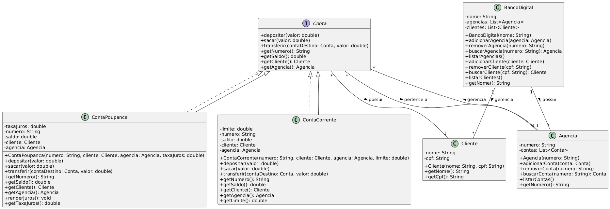

# Desafio DIO - Banco Digital

Considerando nosso conhecimento no domínio bancário, iremos abstrair uma solução orientada a objetos em Java.

Para isso, vamos explorar o seguinte cenário:

Um banco oferece aos seus clientes dois tipos de conta:

- Corrente
- Poupança

Ambas as contas possuem as seguintes funcionalidade:

- Depósito
- Saque
- Transferência entre contas da própria instituição

## Requisitos

- Noções básicas de java e orientações a objeto
- Noções básicas de git e github.

## Implementação

Para implementar esse projeto criei o seguinte diagrama UML:

Interface

- IConta

Classe abstrata:

- Conta
  - Implementa IConta

Classes:

- Banco
- Agencia
- Cliente
- ContaCorrente
  - Extende de conta
- ContaPoupanca
  - Extende de conta

Sendo que o Banco é responsável por gerenciar as agências.
As agências são responsáveis por gerenciar os clientes e as contas.
Ambas as classes conta poupança e conta corrente são subclasses da classe conta, que implementa a interface IConta.

Foram implementados os métodos:

    - sacar
    - depositar
    - transferir
    - imprimirExtrato
    - Listar Clientes
    - Listar Agências
    - Buscar conta
    - Buscar Agência
    - Buscar Cliente

## Pilares da POO

### Abstração

Habilidade de concentrar-se nos aspectos essenciais de um domínio, ignorando características menos importantes ou acidentais.

### Encapsulamento

Encapsular signigifica esconder a implementação dos objetos, criando assim interfaces de uso mais concisas e fáceis de usar/entender. O encapsulamento favorece principalmente dois aspectos de um sistema: a manutenção e a evolução.

### Herança

Permite que você defina uma classe filha que reutiliza (herda), estende ou modifica o comportamento de uma classe pai. A classe cujos membros são herdados é chamada de classe base. A classe que herda os membros da classe base é chamada de classe derivada.

### Polimorfismo

Capacidade de um objeto poder ser referenciado de várias formas. Ou seja, a capacidade de tratar os objetos criados a partir das classes específicas como objetos de uma classe genérica.

Cuidado: O polimorfismo não quer dizer que o objeto fica se transformando, muito pelo contrário, um objeto nasce de um tipo e morre daquele tipo, o que pode mudar é a maneira como nos referenciamos a ele.

## Folder Structure

The workspace contains two folders by default, where:

- `src`: the folder to maintain sources
- `lib`: the folder to maintain dependencies

Meanwhile, the compiled output files will be generated in the `bin` folder by default.

> If you want to customize the folder structure, open `.vscode/settings.json` and update the related settings there.

## Dependency Management

The `JAVA PROJECTS` view allows you to manage your dependencies. More details can be found [here](https://github.com/microsoft/vscode-java-dependency#manage-dependencies).
